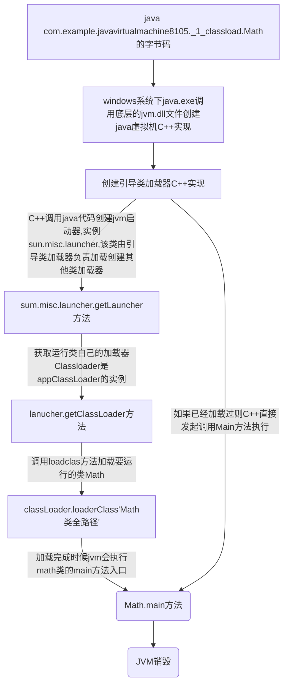
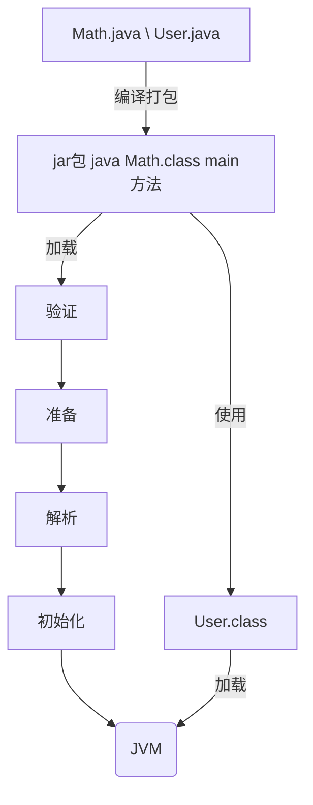
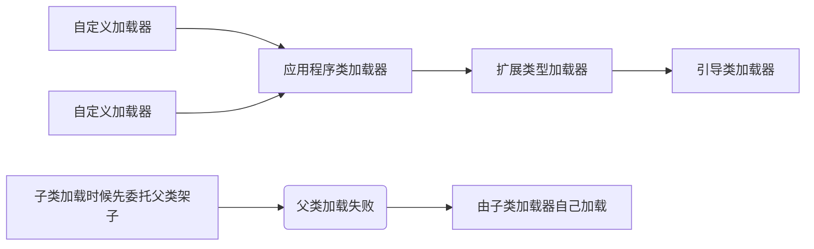
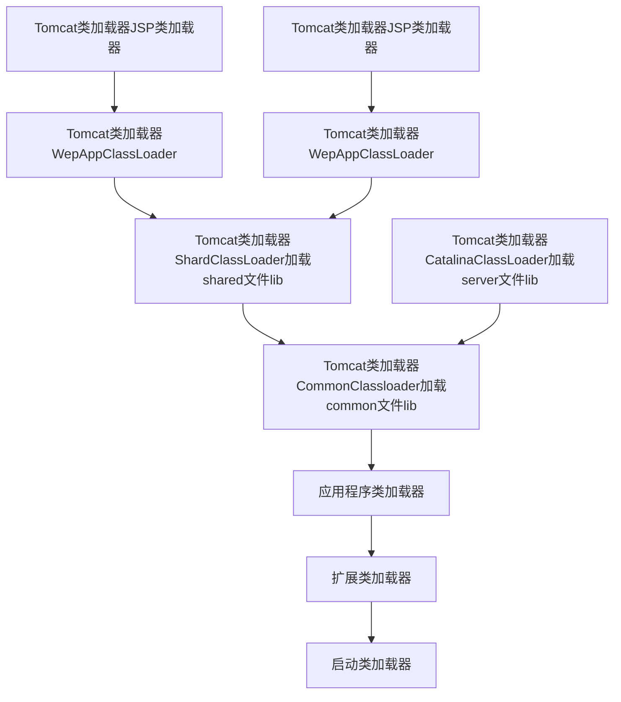
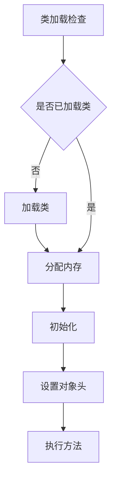
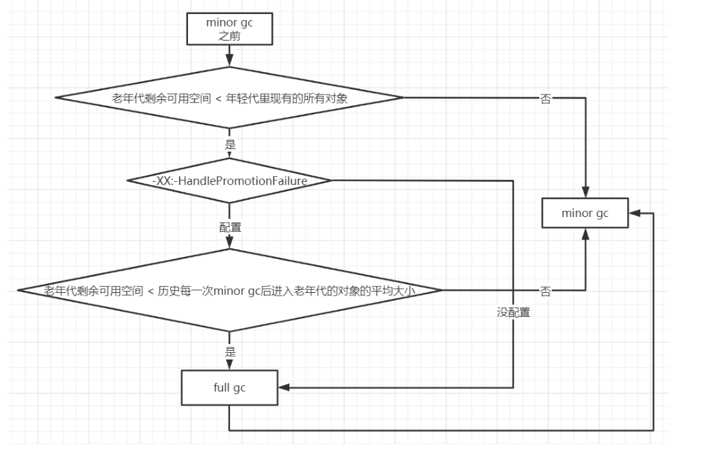

## 相关环境简介

# 1. nacos作为注册中心
- naocs安装目录: /usr/nacos
- 服务器镜像名称:centos7-mysql8.0 ip
- 地址:192.168.139.20
- 启动目录: /usr/nacos/nacos/bin
- 启动命令: sh startup.sh -m standalone
- 服务提供者 nacos-provider8081
- 服务消费者 nacos-consumer8082

# 2. nacos作为配置中心

- 项目名字: nacos-config9001
- 具体配置按照:application.properties\bootstrap.properties进行配置
- 需要在：http://192.168.139.20:8848/nacos 
- 配置中心中新建配置,dateId 为项目名字+profile环境类型
- 获取配置的地方添加@RefreshScope注解可以实现自动刷新同步naocs配置

# 3. feign调用集成

- 项目名字:openfeign-consumer8083
- maven: 主要引用feigin、负载均衡、服务发现的包
然后就可以直接使用了

# 4. sentinel限流和链路追踪集成

- sentinel-dashboard管理控制台安装:
- 服务器镜像名称:centos7-mysql8.0 
- ip 地址:192.168.139.20
- 安装路径: /usr/sentinel-dashboard
- 启动命令: nohup java -Dserver.port=8085 -Dcsp.sentinel.dashboard.server=localhost:8085-Dproject.name=sentinel-dashboard -jar sentinel-dashboard-1.8.6.jar &
- 启动端口: 8085
- web端dashboard界面路径: http://192.168.139.20:8085/#/dashboard/home
- 项目例子: sentinel8084

## 4.1 sentinel限流和feign集成

- 项目例子: sentinel-openfeign8086
- 注意需要引用的maven包和相关服务发现的配置文件

## 4.2  各种限流规则:

1. **默认快速失败**：簇点链路 > 选择对应的请求 > 点击流控按钮 >QPS 1 >点击新增并添加

   快速点击(超过一秒一次QPS=1)请求对应的链接返回: Blocked by Sentinel (flow limiting)

2. **关联模式**, 对请求A进行限流，然后关联选择B:规则配置完成后，会再高并发请求B的时候，A请求会被限流。

3. **链路模式**  对于同时被请求A和请求B调用的请求C，在对C进行限流时候可以根据入口A或B进行单独限流。

4. **预热模式warn up** 可以对阈值设置一个预热时长,预热时间内逐渐到达阈值，使用jmeter的10个线程进行压测，开始报错比较多，然后越来越少，最后没有报错。

5. **排队模式**  对某资源设置排队模式，可以设置可以处理的线程数，然后其他的进入等待时间里边。

6. **慢调用比例模式** 在熔断规则里边，对对应的资源设置慢调用比例，设置RT超过200毫秒的即为慢调用，比例阈值：范围是0到1，可以理解为百分数，即100%以内；然后设置熔断时长(在达到慢调用阈值后会拒绝接收服务的时长),最后参数是统计时长，即统计慢调用比例的时间长度。

7. **异常比例模式**，于上边的类似

8. **异常数模式**，于上边的类似

9. 可以使用 @SentinelResource(value = "testHotKey",blockHandler = "dealHandler_testHotKey") 自定义某个资源报错后的处理器

   ```java
   public String dealHandler_testHotKey(String p1, String p2, BlockException exception)
   {
       return "-----dealHandler_testHotKey";
   }
   ```


# 5. 分布式事务 seata

[Seata 官网](http://seata.io/zh-cn/docs/overview/what-is-seata.html)

##### AT模式：

两阶段提交协议的演变：

- 一阶段：业务数据和回滚日志记录在同一个本地事务中提交，释放本地锁和连接资源。

- 二阶段：

  - 提交异步化，非常快速地完成。

  - 回滚通过一阶段的回滚日志进行反向补偿。

    

###### 写隔离

- 一阶段本地事务提交前，需要确保先拿到 **全局锁** 。
- 拿不到 **全局锁** ，不能提交本地事务。
- 拿 **全局锁** 的尝试被限制在一定范围内，超出范围将放弃，并回滚本地事务，释放本地锁。

###### 读隔离

在数据库本地事务隔离级别 读已提交（Read Committed） 或以上的基础上，Seata（AT 模式）的默认全局隔离级别是 读未提交（Read Uncommitted） 

如果应用在特定场景下，必需要求全局的 读已提交 ，目前 Seata 的方式是通过 SELECT FOR UPDATE 语句的代理。

SELECT FOR UPDATE 语句的执行会申请 **全局锁** ，如果 **全局锁** 被其他事务持有，则释放本地锁（回滚 SELECT FOR UPDATE 语句的本地执行）并重试。这个过程中，查询是被 block 住的，直到 **全局锁** 拿到，即读取的相关数据是 **已提交** 的，才返回。

出于总体性能上的考虑，Seata 目前的方案并没有对所有 SELECT 语句都进行代理，仅针对 FOR UPDATE 的 SELECT 语句。

##### TCC模式

回顾总览中的描述：一个分布式的全局事务，整体是 两阶段提交 的模型。全局事务是由若干分支事务组成的，分支事务要满足 两阶段提交 的模型要求，即需要每个分支事务都具备自己的：

- 一阶段 prepare 行为
- 二阶段 commit 或 rollback 行为

相应的，TCC 模式，不依赖于底层数据资源的事务支持：

- 一阶段 prepare 行为：调用 **自定义** 的 prepare 逻辑。
- 二阶段 commit 行为：调用 **自定义** 的 commit 逻辑。
- 二阶段 rollback 行为：调用 **自定义** 的 rollback 逻辑。

所谓 TCC 模式，是指支持把 **自定义** 的分支事务纳入到全局事务的管理中。

##### Saga 模式

Saga模式是SEATA提供的长事务解决方案，在Saga模式中，业务流程中每个参与者都提交本地事务，当出现某一个参与者失败则补偿前面已经成功的参与者，一阶段正向服务和二阶段补偿服务都由业务开发实现。


#### [Seata部署指南 官网](https://seata.io/zh-cn/docs/ops/deploy-guide-beginner.html)

[(seata整合nacos 以db方式部署](https://blog.csdn.net/weixin_43582081/article/details/126071674)


#### seata安装

```xshell
安装路径：/usr/seata/seata/bin

启动命令: sh [seata-server.sh](http://seata-server.sh/) -h 127.0.0.1 -p 8091 -m db
```


## seata分布式事务例子

##### 业务概述：

这里我们会创建三个服务，一个订单服务，一个库存服务，一个账户服务。当用户下单时，会在订单服务中创建一个订单，然后通过远程调用库存服务来扣减下单商品的库存，再通过远程调用账户服务来扣减用户账户里面的余额，最后在订单服务中修改订单状态为已完成。

该操作跨越三个数据库，有两次远程调用，很明显会有分布式事务问题。


下订单--->扣库存--->减账户(余额)

##### 相关数据库:

seata_order 存储订单的数据库

```sql
CREATE DATABASE seata_order;

CREATE TABLE t_order (
  `id` BIGINT(11) NOT NULL AUTO_INCREMENT PRIMARY KEY,
  `user_id` BIGINT(11) DEFAULT NULL COMMENT '用户id',
  `product_id` BIGINT(11) DEFAULT NULL COMMENT '产品id',
  `count` INT(11) DEFAULT NULL COMMENT '数量',
  `money` DECIMAL(11,0) DEFAULT NULL COMMENT '金额',
  `status` INT(1) DEFAULT NULL COMMENT '订单状态：0：创建中；1：已完结' 
) ENGINE=INNODB AUTO_INCREMENT=7 DEFAULT CHARSET=utf8;

SELECT * FROM t_order;
```

seata_storage 存储库存的数据库

```sql
CREATE DATABASE seata_storage;

CREATE TABLE t_storage (
 `id` BIGINT(11) NOT NULL AUTO_INCREMENT PRIMARY KEY,
 `product_id` BIGINT(11) DEFAULT NULL COMMENT '产品id',
 `total` INT(11) DEFAULT NULL COMMENT '总库存',
 `used` INT(11) DEFAULT NULL COMMENT '已用库存',
 `residue` INT(11) DEFAULT NULL COMMENT '剩余库存'
) ENGINE=INNODB AUTO_INCREMENT=2 DEFAULT CHARSET=utf8;
 
 
INSERT INTO seata_storage.t_storage(`id`, `product_id`, `total`, `used`, `residue`)
VALUES ('1', '1', '100', '0', '100');
 
SELECT * FROM t_storage;
```

seata_account 存储账户信息的数据库

```sql
CREATE TABLE t_account (
  `id` BIGINT(11) NOT NULL AUTO_INCREMENT PRIMARY KEY COMMENT 'id',
  `user_id` BIGINT(11) DEFAULT NULL COMMENT '用户id',
  `total` DECIMAL(10,0) DEFAULT NULL COMMENT '总额度',
  `used` DECIMAL(10,0) DEFAULT NULL COMMENT '已用余额',
  `residue` DECIMAL(10,0) DEFAULT '0' COMMENT '剩余可用额度'
) ENGINE=INNODB AUTO_INCREMENT=2 DEFAULT CHARSET=utf8;
 
INSERT INTO seata_account.t_account(`id`, `user_id`, `total`, `used`, `residue`)  VALUES ('1', '1', '1000', '0', '1000');
 
SELECT * FROM t_account;
```


注意相关业务库中均需要undo_log:

```sql
CREATE TABLE `undo_log`
(
    `id`            BIGINT(20)   NOT NULL AUTO_INCREMENT,
    `branch_id`     BIGINT(20)   NOT NULL,
    `xid`           VARCHAR(100) NOT NULL,
    `context`       VARCHAR(128) NOT NULL,
    `rollback_info` LONGBLOB     NOT NULL,
    `log_status`    INT(11)      NOT NULL,
    `log_created`   DATETIME     NOT NULL,
    `log_modified`  DATETIME     NOT NULL,
    `ext`           VARCHAR(100) DEFAULT NULL,
    PRIMARY KEY (`id`),
    UNIQUE KEY `ux_undo_log` (`xid`, `branch_id`)
) ENGINE = InnoDB
  AUTO_INCREMENT = 1
  DEFAULT CHARSET = utf8
```


#### 相关服务：

在订单中开始调用，并在调用的方法上添加@GlobalTransactional(rollbackFor = Exception.class) 即可，后续方法报错都会全局回滚。

seata-order8088

seata-storage8089

seata-account8100


# 6. shardingsphere

## 6.1 服务部署 一主多从配置

- 主服务器：容器名`atguigu-mysql-master`，端口`3306`

- 从服务器：容器名`atguigu-mysql-slave1`，端口`3307`

- 从服务器：容器名`atguigu-mysql-slave2`，端口`3308`

  1. 关闭防火墙

     ```shell
     #关闭docker
     systemctl stop docker
     #关闭防火墙
     systemctl stop firewalld
     #启动docker
     systemctl start docker
     ```

  2. 安装master数据库

     ```shell
     docker run -d \
     -p 3306:3306 \
     -v /atguigu/mysql/master/conf:/etc/mysql/conf.d \
     -v /atguigu/mysql/master/data:/var/lib/mysql \
     -e MYSQL_ROOT_PASSWORD=123456 \
     --name atguigu-mysql-master \
     mysql:8.0.29
     ```

  3. 创建mysql主服务器文件

     默认情况下MySQL的binlog日志是自动开启的，可以通过如下配置定义一些可选配置

     vim /atguigu/mysql/master/conf/my.cnf

     配置如下内容

     ```bash
     [mysqld]
     # 服务器唯一id，默认值1
     server-id=1
     # 设置日志格式，默认值ROW
     binlog_format=STATEMENT
     # 二进制日志名，默认binlog
     # log-bin=binlog
     # 设置需要复制的数据库，默认复制全部数据库
     #binlog-do-db=mytestdb
     # 设置不需要复制的数据库
     #binlog-ignore-db=mysql
     #binlog-ignore-db=infomation_schema
     ```

     重启MySQL容器

     ```bash
     docker restart atguigu-mysql-master
     ```

     

  4. 使用命令行登录MySQL主服务器：

     ```bash
     #进入容器：env LANG=C.UTF-8 避免容器中显示中文乱码
     docker exec -it atguigu-mysql-master env LANG=C.UTF-8 /bin/bash
     #进入容器内的mysql命令行
     mysql -uroot -p
     #修改默认密码校验方式
     ALTER USER 'root'@'%' IDENTIFIED WITH mysql_native_password BY '123456';
     ```

     

  5. 主机中创建slave用户：

     ```bash
     -- 创建slave用户
     CREATE USER 'atguigu_slave'@'%';
     -- 设置密码
     ALTER USER 'atguigu_slave'@'%' IDENTIFIED WITH mysql_native_password BY '123456';
     -- 授予复制权限
     GRANT REPLICATION SLAVE ON *.* TO 'atguigu_slave'@'%';
     -- 刷新权限
     FLUSH PRIVILEGES;
     ```

     

  6. 主机中查询master状态：

  7. 准备从服务器

     可以配置多台从机slave1、slave2...，这里以配置slave1为例

  8. 在docker中创建并启动MySQL从服务器：端口3307`

     ```bash
     docker run -d \
     -p 3307:3306 \
     -v /atguigu/mysql/slave1/conf:/etc/mysql/conf.d \
     -v /atguigu/mysql/slave1/data:/var/lib/mysql \
     -e MYSQL_ROOT_PASSWORD=123456 \
     --name atguigu-mysql-slave1 \
     mysql:8.0.29
     ```

     

  9. 创建MySQL从服务器配置文件：

     vim /atguigu/mysql/slave1/conf/my.cnf

     **配置内容**

     ```bash
     [mysqld]
     # 服务器唯一id，每台服务器的id必须不同，如果配置其他从机，注意修改id
     server-id=2
     # 中继日志名，默认xxxxxxxxxxxx-relay-bin
     #relay-log=relay-bin
     ```

  10. 使用命令行登录MySQL从服务器：

      ```bash
      #进入容器：
      docker exec -it atguigu-mysql-slave1 env LANG=C.UTF-8 /bin/bash
      #进入容器内的mysql命令行
      mysql -uroot -p
      #修改默认密码校验方式
      ALTER USER 'root'@'%' IDENTIFIED WITH mysql_native_password BY '123456';
      ```

  11. 在从机上配置主从关系：

      在从服务的mysql上执行下面的sql

      ```bash
      CHANGE MASTER TO MASTER_HOST='192.168.139.30', 
      MASTER_USER='atguigu_slave',MASTER_PASSWORD='123456', MASTER_PORT=3306,
      MASTER_LOG_FILE='binlog.000003',MASTER_LOG_POS=1357; 
      ```

      

  12. 启动主从同步

      启动从机的复制功能，在主服务器上执行SQL

      ```bashs
      START SLAVE;
      -- 查看状态（不需要分号）
      SHOW SLAVE STATUS\G
      ```

  13. 下面两个参数都是Yes，则说明主从配置成功

      ```bash
      Slave_IO_Running:Yes
      Slave_SQL_Running:Yes
      ```

  14. 实现主从同步

      在主机中执行以下SQL，在从机中查看数据库、表和数据是否已经被同步

      ```sql
      CREATE DATABASE db_user;
      USE db_user;
      CREATE TABLE t_user (
       id BIGINT AUTO_INCREMENT,
       uname VARCHAR(30),
       PRIMARY KEY (id)
      );
      INSERT INTO t_user(uname) VALUES('zhang3');
      INSERT INTO t_user(uname) VALUES(@@hostname);
      ```

  15. 停止和重置

      ```bash
      -- 在从机上执行。功能说明：停止I/O 线程和SQL线程的操作。
      stop slave; 
      
      -- 在从机上执行。功能说明：用于删除SLAVE数据库的relaylog日志文件，并重新启用新的relaylog文件。
      reset slave;
      
      -- 在主机上执行。功能说明：删除所有的binglog日志文件，并将日志索引文件清空，重新开始所有新的日志文件。
      -- 用于第一次进行搭建主从库时，进行主库binlog初始化工作；
      reset master;
      ```

      

## 6.2 shardingSphere-jdbc

#### 项目

shardingsphere-jdbc8101

#### 读写分离：

**application.properties** 属性配置

以及测试测试类**ReadwriteTest**的代码

#### 事务测试

为了保证主从库间的事务一致性，避免跨服务的分布式事务，ShardingSphere-JDBC的`主从模型中，事务中的数据读写均用主库`。

 * 不添加@Transactional：insert对主库操作，select对从库操作
 * 添加@Transactional：则insert和select均对主库操作

**注意：**在JUnit环境下的@Transactional注解，默认情况下就会对事务进行回滚（即使在没加注解@Rollback，也会对事务回滚）

注意: **为了使测试数据不对数据库造成污染，在使用Spring-test进行的单元测试的时候，默认会对事务进行回滚，即@Rollback 默认是true**，如果想要测试数据不回滚，可设置@[Rollback](https://so.csdn.net/so/search?q=Rollback&spm=1001.2101.3001.7020)(value = false) 。


以及测试测试类**testTrans**的代码

#### 负载均衡测试

```java
testSelectAll 查两次user表，查看日志可以看出第第一次slave1 第二次是slave2
```


##  6.3 ShardingSphere-JDBC垂直分片

#### 服务器准备

服务器规划：使用`docker`方式创建如下容器

- 服务器：容器名`server-user`，端口`3301`
- 服务器：容器名`server-order`，端口`3302`

1. 创建server-user服务器

   - 创建容器：

     ```xshell
     docker run -d \
     -p 3301:3306 \
     -v /atguigu/server/user/conf:/etc/mysql/conf.d \
     -v /atguigu/server/user/data:/var/lib/mysql \
     -e MYSQL_ROOT_PASSWORD=123456 \
     --name server-user \
     mysql:8.0.29
     ```

   - 登录MySQL服务器

     ```xshell
     #进入容器：
     docker exec -it server-user env LANG=C.UTF-8 /bin/bash
     #进入容器内的mysql命令行
     mysql -uroot -p
     #修改默认密码插件
     ALTER USER 'root'@'%' IDENTIFIED WITH mysql_native_password BY '123456';
     ```

     

   - 创建表

     ```sql
     CREATE DATABASE db_user;
     USE db_user;
     CREATE TABLE t_user (
      id BIGINT AUTO_INCREMENT,
      uname VARCHAR(30),
      PRIMARY KEY (id)
     );
     ```

     

2.  创建server-order容器

   - 创建容器

     ```xshell
     docker run -d \
     -p 3302:3306 \
     -v /atguigu/server/order/conf:/etc/mysql/conf.d \
     -v /atguigu/server/order/data:/var/lib/mysql \
     -e MYSQL_ROOT_PASSWORD=123456 \
     --name server-order \
     mysql:8.0.29
     ```

   - 登录MySQL服务器

     ```xshell
     #进入容器：
     docker exec -it server-order env LANG=C.UTF-8 /bin/bash
     #进入容器内的mysql命令行
     mysql -uroot -p
     #修改默认密码插件
     ALTER USER 'root'@'%' IDENTIFIED WITH mysql_native_password BY '123456';
     ```

   - 创建数据库

     ```xshell
     CREATE DATABASE db_order;
     USE db_order;
     CREATE TABLE t_order (
       id BIGINT AUTO_INCREMENT,
       order_no VARCHAR(30),
       user_id BIGINT,
       amount DECIMAL(10,2),
       PRIMARY KEY(id) 
     );
     ```

   

   #### 项目测试

   shardingsphere-jdbc8102-verticalSlice

   ShardingTest 测试类

​       application.properties 属性配置


## 6.4 ShardingSphere-JDBC水平分片

#### 准备服务器

- 服务器：容器名`server-order0`，端口`3310`
- 服务器：容器名`server-order1`，端口`3311`

1. 创建server-order0容器-创建容器

   ```bash
   docker run -d \
   -p 3310:3306 \
   -v /atguigu/server/order0/conf:/etc/mysql/conf.d \
   -v /atguigu/server/order0/data:/var/lib/mysql \
   -e MYSQL_ROOT_PASSWORD=123456 \
   --name server-order0 \
   mysql:8.0.29
   ```

2. 登录MySQL服务器：

   ```bash
   #进入容器：
   docker exec -it server-order0 env LANG=C.UTF-8 /bin/bash
   #进入容器内的mysql命令行
   mysql -uroot -p
   #修改默认密码插件
   ALTER USER 'root'@'%' IDENTIFIED WITH mysql_native_password BY '123456';
   ```

3. 创建数据库

   `注意：`水平分片的id需要在业务层实现，`不能依赖数据库的主键自增`

   ```sql
   CREATE DATABASE db_order;
   USE db_order;
   CREATE TABLE t_order0 (
     id BIGINT,
     order_no VARCHAR(30),
     user_id BIGINT,
     amount DECIMAL(10,2),
     PRIMARY KEY(id) 
   );
   CREATE TABLE t_order1 (
     id BIGINT,
     order_no VARCHAR(30),
     user_id BIGINT,
     amount DECIMAL(10,2),
     PRIMARY KEY(id) 
   );
   ```

4. 创建server-order1容器-创建容器

   ```bash
   docker run -d \
   -p 3311:3306 \
   -v /atguigu/server/order1/conf:/etc/mysql/conf.d \
   -v /atguigu/server/order1/data:/var/lib/mysql \
   -e MYSQL_ROOT_PASSWORD=123456 \
   --name server-order1 \
   mysql:8.0.29
   ```

5. 登录MySQL服务器：

   ```bash
   #进入容器：
   docker exec -it server-order1 env LANG=C.UTF-8 /bin/bash
   #进入容器内的mysql命令行
   mysql -uroot -p
   #修改默认密码插件
   ALTER USER 'root'@'%' IDENTIFIED WITH mysql_native_password BY '123456';
   ```

   

6. 创建数据库：**和server-order0相同

   ```sql
   CREATE DATABASE db_order;
   USE db_order;
   CREATE TABLE t_order0 (
     id BIGINT,
     order_no VARCHAR(30),
     user_id BIGINT,
     amount DECIMAL(10,2),
     PRIMARY KEY(id) 
   );
   CREATE TABLE t_order1 (
     id BIGINT,
     order_no VARCHAR(30),
     user_id BIGINT,
     amount DECIMAL(10,2),
     PRIMARY KEY(id) 
   );
   ```


#### 项目配置

shardingsphere-jdbc8103-horizontalSlice 项目

详情参考项目的 属性配置文件和实体类以及测试用例

#### 项目简单解析

实现对对t_order进行分库分表，分别在server-order0、server-order1两个数据库上建立t_order0和t_order1一共四张表，配置对应的数据源，然后再根据user_id模2分别对数据进行拆分。

#### 关联表

在`server-order0、server-order1`服务器中分别创建两张订单详情表`t_order_item0、t_order_item1`

我们希望`同一个用户的订单表和订单详情表中的数据都在同一个数据源中，避免跨库关联`，因此这两张表我们使用相同的分片策略。

那么在`t_order_item`中我们也需要创建`order_no`和`user_id`这两个分片键

```sql

CREATE TABLE t_order_item0(
    id BIGINT,
    order_no VARCHAR(30),
    user_id BIGINT,
    price DECIMAL(10,2),
    `count` INT,
    PRIMARY KEY(id)
);

CREATE TABLE t_order_item1(
    id BIGINT,
    order_no VARCHAR(30),
    user_id BIGINT,
    price DECIMAL(10,2),
    `count` INT,
    PRIMARY KEY(id)
);
```


配置详情见： application-关联查询.properties

#### 绑定表

**需求：**查询每个订单的订单号和总订单金额

配置添加

```sql
#------------------------绑定表
spring.shardingsphere.rules.sharding.binding-tables[0]=t_order,t_order_item
```

配置完绑定表后再次进行关联查询的测试：

- **如果不配置绑定表：测试的结果为8个SQL。**多表关联查询会出现笛卡尔积关联。

- **如果配置绑定表：测试的结果为4个SQL。** 多表关联查询不会出现笛卡尔积关联，关联查询效率将大大提升。


`绑定表：`指分片规则一致的一组分片表。 使用绑定表进行多表关联查询时，必须使用分片键进行关联，否则会出现笛卡尔积关联或跨库关联，从而影响查询效率。

#### 广播表

指所有的分片数据源中都存在的表，表结构及其数据在每个数据库中均完全一致。 适用于数据量不大且需要与海量数据的表进行关联查询的场景，例如：字典表。

广播具有以下特性：

（1）插入、更新操作会实时在所有节点上执行，保持各个分片的数据一致性

（2）查询操作，只从一个节点获取

（3）可以跟任何一个表进行 JOIN 操作

在server-order0、server-order1和server-user服务器中分别创建t_dict表

```sql
CREATE TABLE t_dict(
    id BIGINT,
    dict_type VARCHAR(200),
    PRIMARY KEY(id)
);
```

添加配置

```properties
#数据节点可不配置，默认情况下，向所有数据源广播
spring.shardingsphere.rules.sharding.tables.t_dict.actual-data-nodes=server-user.t_dict,server-order$->{0..1}.t_dict

# 广播表
spring.shardingsphere.rules.sharding.broadcast-tables[0]=t_dict
```

具体查看项目测试用例


# 7. Shardingsphere-Proxy

## 7.0 安装位置和配置信息

**虚拟机:  192.168.138.30  server-proxy-a**

**链接mysql :  192.168.138.30  3321  root root**

## 7.1 Shardingsphere-Proxy 安装

目前 ShardingSphere-Proxy 提供了 3 种获取方式：

- [二进制发布包](https://shardingsphere.apache.org/document/5.1.1/cn/user-manual/shardingsphere-proxy/startup/bin/)
- [Docker](https://shardingsphere.apache.org/document/5.1.1/cn/user-manual/shardingsphere-proxy/startup/docker/)
- [Helm]

##### 二进制包安装

二进制包既可以Linux系统运行，又可以在windows系统运行

**step1：解压二进制包**

`apache-shardingsphere-5.1.1-shardingsphere-proxy-bin.tar.gz`

windows：使用解压软件解压文件

Linux：将文件上传至/opt目录，并解压

```shell
tar -zxvf apache-shardingsphere-5.1.1-shardingsphere-proxy-bin.tar.gz
```


**step2：MySQL驱动**

`mysql-connector-java-8.0.22.jar`

将MySQl驱动放至解压目录中的`ext-lib`目录


**spte3：修改配置conf/server.yaml**

```yaml
rules:
  - !AUTHORITY
    users:
      - root@%:root
    provider:
      type: ALL_PRIVILEGES_PERMITTED

props:
  sql-show: true
```


**spte4：启动ShardingSphere-Proxy**

Linux 操作系统请运行 `bin/start.sh`

Windows 操作系统请运行 `bin/start.bat` 

指定端口号和配置文件目录：`bin/start.bat ${proxy_port} ${proxy_conf_directory}` 


**step5：远程连接ShardingSphere-Proxy**

远程访问

```shell
mysql -h192.168.100.1 -P3307 -uroot -p
```


**step6：访问测试**

```sql
show databases;
```


##### 使用Docker安装

**step1：启动Docker容器**

```shell
docker run -d \
-v /atguigu/server/proxy-a/conf:/opt/shardingsphere-proxy/conf \
-v /atguigu/server/proxy-a/ext-lib:/opt/shardingsphere-proxy/ext-lib \
-e ES_JAVA_OPTS="-Xmx256m -Xms256m -Xmn128m" \
-p 3321:3307 \
--name server-proxy-a \
apache/shardingsphere-proxy:5.1.1
```


**step2：上传MySQL驱动**

将MySQl驱动上传至`/atguigu/server/proxy-a/ext-lib`目录


**spte3：修改配置server.yaml**

```yaml
rules:
  - !AUTHORITY
    users:
      - root@%:root
    provider:
      type: ALL_PRIVILEGES_PERMITTED

props:
  sql-show: true
```

将配置文件上传至`/atguigu/server/proxy-a/conf`目录


**spte4：重启容器**

```shell
docker restart server-proxy-a
```


**step5：远程连接ShardingSphere-Proxy**

ShardingSphere-Proxy容器中默认情况下没有mysql命令行客户端的安装，因此需要远程访问

```shell
mysql -h192.168.100.201 -P3321 -uroot -p
```


**step6：访问测试**

```sql
show databases;
```


**常见问题：docker容器无法远程连接**

容器可以成功的创建并启动，但是无法远程连接。排除防火墙和网络等问题后，看看是不是因为容器内存不足导致。

`原因：`容器可分配内存不足

`查看办法：`进入容器后查看ShardingSphere-Proxy的日志，如有有`cannot allocate memory`，则说明容器内存不足

```shell
docker exec -it server-proxy-a env LANG=C.UTF-8 /bin/bash
cd /opt/shardingsphere-proxy/logs
tail stdout.log 
```


`解决方案：`创建容器的时候使用JVM参数

```shell
-e ES_JAVA_OPTS="-Xmx256m -Xms256m -Xmn128m"
```


## 7.2 ShardingSphere-Proxy读写分离


shardingSphere-proxy8104 项目


##### 1、修改配置文件

**修改配置config-readwrite-splitting.yaml**

```yaml
schemaName: readwrite_splitting_db

dataSources:
  write_ds:
    url: jdbc:mysql://192.168.100.201:3306/db_user?serverTimezone=UTC&useSSL=false
    username: root
    password: 123456
    connectionTimeoutMilliseconds: 30000
    idleTimeoutMilliseconds: 60000
    maxLifetimeMilliseconds: 1800000
    maxPoolSize: 50
    minPoolSize: 1
  read_ds_0:
    url: jdbc:mysql://192.168.100.201:3307/db_user?serverTimezone=UTC&useSSL=false
    username: root
    password: 123456
    connectionTimeoutMilliseconds: 30000
    idleTimeoutMilliseconds: 60000
    maxLifetimeMilliseconds: 1800000
    maxPoolSize: 50
    minPoolSize: 1
  read_ds_1:
    url: jdbc:mysql://192.168.100.201:3308/db_user?serverTimezone=UTC&useSSL=false
    username: root
    password: 123456
    connectionTimeoutMilliseconds: 30000
    idleTimeoutMilliseconds: 60000
    maxLifetimeMilliseconds: 1800000
    maxPoolSize: 50
    minPoolSize: 1

rules:
- !READWRITE_SPLITTING
  dataSources:
    readwrite_ds:
      type: Static
      props:
        write-data-source-name: write_ds
        read-data-source-names: read_ds_0,read_ds_1
```

将配置文件上传至`/atguigu/server/proxy-a/conf`目录


##### **重启容器**

```shell
docker restart server-proxy-a
```


##### 2、实时查看日志

可以通过这种方式查看服务器中输出的SQL语句

```shell
docker exec -it server-proxy-a env LANG=C.UTF-8 /bin/bash
tail -f /opt/shardingsphere-proxy/logs/stdout.log 
```


##### 3、远程访问测试

```sql
mysql> show databases;
mysql> use readwrite_splitting_db;
mysql> show tables;
mysql> select * from t_user;
mysql> select * from t_user;
mysql> insert into t_user(uname) values('wang5');
```


## 7.3 ShardingSphere-Proxy垂直分片

配置和测试

##### 1、修改配置文件

如果使用的docker就添加这个配置文件。

###### **修改配置config-sharding.yaml**

```yaml
schemaName: sharding_db

dataSources:
  ds_0:
    url: jdbc:mysql://192.168.100.201:3301/db_user?serverTimezone=UTC&useSSL=false
    username: root
    password: 123456
    connectionTimeoutMilliseconds: 30000
    idleTimeoutMilliseconds: 60000
    maxLifetimeMilliseconds: 1800000
    maxPoolSize: 50
    minPoolSize: 1
  ds_1:
    url: jdbc:mysql://192.168.100.201:3302/db_order?serverTimezone=UTC&useSSL=false
    username: root
    password: 123456
    connectionTimeoutMilliseconds: 30000
    idleTimeoutMilliseconds: 60000
    maxLifetimeMilliseconds: 1800000
    maxPoolSize: 50
    minPoolSize: 1

rules:
- !SHARDING
  tables:
    t_user:
      actualDataNodes: ds_0.t_user
    t_order:
      actualDataNodes: ds_1.t_order
```


##### 2、实时查看日志

可以通过这种方式查看服务器中输出的SQL语句

```shell
docker exec -it server-proxy-a env LANG=C.UTF-8 /bin/bash
tail -f /opt/shardingsphere-proxy/logs/stdout.log 
```


##### 3、远程访问测试

```sql
mysql> show databases;
mysql> use sharding_db;
mysql> show tables;
mysql> select * from t_order;
mysql> select * from t_user;
```


## 7.4  ShardingSphere-Proxy水平分片

##### 1、修改配置文件

**修改配置config-sharding.yaml**

```yaml
schemaName: sharding_db

dataSources:
  ds_user:
    url: jdbc:mysql://192.168.100.201:3301/db_user?serverTimezone=UTC&useSSL=false
    username: root
    password: 123456
    connectionTimeoutMilliseconds: 30000
    idleTimeoutMilliseconds: 60000
    maxLifetimeMilliseconds: 1800000
    maxPoolSize: 50
    minPoolSize: 1
  ds_order0:
    url: jdbc:mysql://192.168.100.201:3310/db_order?serverTimezone=UTC&useSSL=false
    username: root
    password: 123456
    connectionTimeoutMilliseconds: 30000
    idleTimeoutMilliseconds: 60000
    maxLifetimeMilliseconds: 1800000
    maxPoolSize: 50
    minPoolSize: 1
  ds_order1:
    url: jdbc:mysql://192.168.100.201:3311/db_order?serverTimezone=UTC&useSSL=false
    username: root
    password: 123456
    connectionTimeoutMilliseconds: 30000
    idleTimeoutMilliseconds: 60000
    maxLifetimeMilliseconds: 1800000
    maxPoolSize: 50
    minPoolSize: 1

rules:
- !SHARDING
  tables:
    t_user:
      actualDataNodes: ds_user.t_user

    t_order:
      actualDataNodes: ds_order${0..1}.t_order${0..1}
      databaseStrategy:
        standard:
          shardingColumn: user_id
          shardingAlgorithmName: alg_mod
      tableStrategy:
        standard:
          shardingColumn: order_no
          shardingAlgorithmName: alg_hash_mod
      keyGenerateStrategy:
        column: id
        keyGeneratorName: snowflake
    t_order_item:
      actualDataNodes: ds_order${0..1}.t_order_item${0..1}
      databaseStrategy:
        standard:
          shardingColumn: user_id
          shardingAlgorithmName: alg_mod
      tableStrategy:
        standard:
          shardingColumn: order_no
          shardingAlgorithmName: alg_hash_mod
      keyGenerateStrategy:
        column: id
        keyGeneratorName: snowflake

  bindingTables:
    - t_order,t_order_item


  broadcastTables:
    - t_dict

  shardingAlgorithms:
    alg_inline_userid:
      type: INLINE
      props:
        algorithm-expression: server-order$->{user_id % 2}
    alg_mod:
      type: MOD
      props:
        sharding-count: 2
    alg_hash_mod:
      type: HASH_MOD
      props:
        sharding-count: 2
  
  keyGenerators:
    snowflake:
      type: SNOWFLAKE

```


##### 2、实时查看日志

可以通过这种方式查看服务器中输出的SQL语句

```shell
docker exec -it server-proxy-a env LANG=C.UTF-8 /bin/bash
tail -f /opt/shardingsphere-proxy/logs/stdout.log 
```


##### 3、远程访问测试

```sql
mysql> show databases;
mysql> use sharding_db;
mysql> show tables;
mysql> select * from t_order; --测试水平分片
mysql> select * from t_dict; --测试广播表
```


# 8. JVM

## 8.1 类加载篇

### 8.1.1类加载一般的过程





其中loadclass的类记载过程有如下几步:


- 加载：在硬盘上查找并通过IO读入字节码文件，使用到类是才会加载，例如调用类的main()方法、new对象等等，在加载阶段会在内存中生成一个代表这个类的java.lang.Class对象，作为方法区这个类的各种数据的访问入口
- 验证: 校验字节码文件的正确性
- 准备：给类的静态变量分配内粗，并赋予默认值
- 解析：将符号引用替换为直接引用，该阶段会把一些静态方法（符号引用，比如：main()方法替换为指向数据所存内存的指针或者句柄（直接引用），动态链接过程（类加载期间完成）、动态链接是在程序运行期间完成的将符号引用替换为直接引用）
- 初始化：对类的静态变量初始化指定的值，执行静态代码块




类被加载到方法去中后主要包含 运行时常量池、类型信息、字段信息、方法信息、类加载器的引用、对应class实例的引用等信息。

类加载器的引用：这个类到加载器实例的引用

对应class实例的引用：类加载器在加载信息放到方法区中后，会创建一个对应的class类型的对象实例放到堆中，作为开发人员访问方法区中类定义的入口和切入点。

##### 双亲委派

JVM类加载器有亲子层级结构的，如下图:



##### Tomcat自定义加载器详情



- commonLoader: tomcat最基本的类加载器，加载路径中的class可以被tomcat容器本身以及各个WebApp访问
- catalinaLoader tomcat容器私有的类加载器，加载路径中的class对于Webapp不可见
- shardLoader 各个Webapp共享的类加载器，加载路径中的class对于所有Webapp可见，但是对于tomcat容器不可见
- WebappClassLoader 各个Webapp私有的类加载器，加载路径中的class只对于当前Webapp可见，比如加载war包里相关的类，每个war包应用都有自己的WebAppClassLoader，实现互相隔离，比如不同war包应用引入了不同的spring版本，这样实现就是加载各自的spring版本


### 8.1.2 jvm内存整体结构


### 8.1.3 对象的生命周期

主要流程




#### 老年代空间分配担保机制

开启参数:-XX:-HandlePromotionFailure 1.8默认开启



#### 对象内存回收算法

- **引用计数算法**

  特点: 对象中添加一个引用计数器，有一个地方引用就+1，引用失效就-1，计数器为0时就是可回收的。

  实现简单、效率高，无法解决循环引用问题。

- **可达性分析算法**

		特点： 将 GC ROOTs对象作为起点，从这些节点向下搜索引用的对象，找到的对象都标记为非垃圾对象，其余未标记的就是非垃圾对象。

#### 常见GC Roots节点：

1. 在虚拟机栈（栈帧中的本地变量表）中引用的对象，譬如各个线程被调用的方法堆栈中使用到的参数、局部变量、临时变量等。
2. 在方法区中类静态属性引用的对象，譬如Java类的引用类型静态变量。
3. 在方法区中常量引用的对象，譬如字符串常量池（String Table）里的引用。
4. 本地方法栈中 JNI（Native方法）引用的对象
5. Java虚拟机内部的引用，如基本数据类型对应的Class对象，一些常驻的异常对象（比如NullPointExcepiton、OutOfMemoryError）等，还有系统类加载器。
6. 所有被同步锁（synchronized关键字）持有的对象。
7. 反映Java虚拟机内部情况的JMXBean、JVMTI中注册的回调、本地代码缓存等。
8. 根据用户所选用的垃圾收集器以及当前回收的内存区域不 同，“临时性”地加入的其他对象。
   

### 8.1.4 常见的引用类型

- 强引用

  ```java
  public static User user = new User();
  ```

- 软引用

  ```java
  软引用：将对象用SoftReference软引用类型的对象包裹，正常情况不会被回收，但是GC做完后发现释放不出空间存放
  新的对象，则会把这些软引用的对象回收掉。软引用可用来实现内存敏感的高速缓存。
      
  public static SoftReference<User> user = new SoftReference<User>(new User());
  ```

- 弱引用

  ```java
  //弱引用 GC发生时就会被回收掉
  WeakReference<User> userWeakReference = new WeakReference<User>(new User());
  ```

- 虚引用

  ```java
  //虚引用 必须 和引用队列 （ReferenceQueue）联合使用
  // 即 当垃圾回收器准备回收一个对象时，若发现它还有虚引用，在回收对象的内存之前，把这个虚引用加入到与之关联的引用队列中
  ReferenceQueue<User> queue = new ReferenceQueue<User>();
  User user1 = new User();
  PhantomReference<User> userPhantomReference = new PhantomReference<User>(user1,queue);
  //在user1被回收后，user1会被假如到queue引用队列里边
  user1 = null;
  ```

  

  ## 

## 8.2 arthas 虚拟机诊断工具使用


```bash
安装虚拟机服务器: 192.168.139.30
启动命令:java -jar /usr/Arthas/arthas-boot.jar --target-ip 192.168.139.30
测试例子启动: nohup java -jar math-game.jar &
arthas配置文件位置: /root/.arthas/lib/3.6.7/arthas
以javaagent方式绑定项目启动: nohup java -javaagent:/usr/Arthas/arthas-agent.jar -jar math-game.jar &
javaagent需要修改配置里边的ip,不然外网无法访问
```

**入门使用总结**

- 启动arthas时候需要指定本机ip，以便指定可以访问的ip,linsten的ip，配置为本机ip：192.168.139.30
- 如果临时查看相关应用可以使用单独jar方式在服务器上启动，然后再根据打印出来的jvm线程号选择应用
- 如果长期绑定一个应用可以在启动应用的时候使用javaagent方式启动，这个时候需要更改配置文件的覆盖策略，以及监听端口
- 另外如果一个服务器上有多个应用，可以先通过jsp获取java进程名字，然后使用 ./as.sh --select math-game指定进程名字，这个应用重启jvm线程号改变后依然有绑定关系，


### 8.2.1 官方快速入门例子:

[快速入门 | arthas (aliyun.com)](https://arthas.aliyun.com/doc/quick-start.html)


### 8.2.2 使用web console查看

[Web Console | arthas (aliyun.com)](https://arthas.aliyun.com/doc/web-console.html)

### 8.2.3 使用Arthas Properties配置项目

[Arthas Properties | arthas (aliyun.com)](https://arthas.aliyun.com/doc/arthas-properties.html)

### 8.2.4 Arthas 常用命令以及使用方式

- trace 
  trace 类地址.类名 方法名 (中间有空格)
- 


